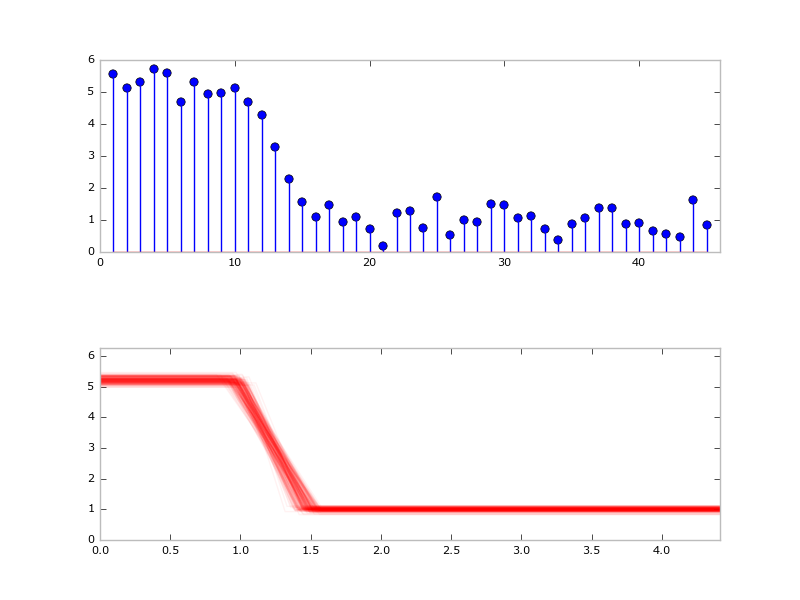

## TODO now
- [ ] red and green channels separate (camera model: same frames, different gains)
- [ ] set prior based on old HMM analysis? (Output of old HMM is in *_Results.mat data files)
- [ ] learn the noise
- [ ] gaussian shot noise
- [ ] animation

## embellishment menu
- [ ] infer number of slopey bits (RJ MCMC)
- [ ] positive probability of instantaneous jumps (just make slopey duration
  density have a delta at zero)
- [ ] hmc / nuts sampling (sampyl could work, only necessary with more
  dimensions)
- [ ] reuse of energy levels (just sample energy levels ahead of time, add
  sequential structure)
- [ ] think about 'energy ladders' in the prior
- [ ] think about multiple fast flat bits: is that an HMM again?

## ideas possibly out of scope / unnecessary
- [ ] geweke tests
- [ ] generate loglike automatically using prob prog!

## Analysis wish list:
Data consist of relatively long-lived “flat bits” where the intensity values
appear to be Gaussian scatter around a mean value (that is, they seem to be
well described as a constant intensity value with some noise). These flat bits
are separated by “slopey” bits that, for the most part, by eye do not seem to
be instantaneous jumps.

For each data set (~100 traces), want:
- mean value +/- error of durations of first flat bit that occurs in each
  trace, second flat bit, and third flat bit (where it exists, not all traces
  get to a third flat bit)
- mean value +/- error of durations of first slopey bit in a trace, second
  slopey bit, and maybe third if we have enough data. Or, if mean+err is too
  hard to get, some equivalent statistic that tells us how long, on average, each
  slopey bit is.
- (bonus because I can do this other ways): Some measure of how much the
  intensity levels change between successive flat bits. For example, on
  average, is the intensity difference between the first and second flat bits the
  same as the second and third flat bits? <- For this I really care about FRET
  values (red/red+green), not intensity per se.
- (bonus because I can do this other ways): Direction reversals: what fraction
  of slopey bits take you to a higher, rather than lower intensity value (that
  is, how often is the n+1 flat bit at a higher intensity than the nth one)
- (bonus because I’m not sure yet if I need to care, and not sure if my data
  can speak to this): Are the slopey bits actually composed of many very short
  flat bits separated by instantaneous drops?
