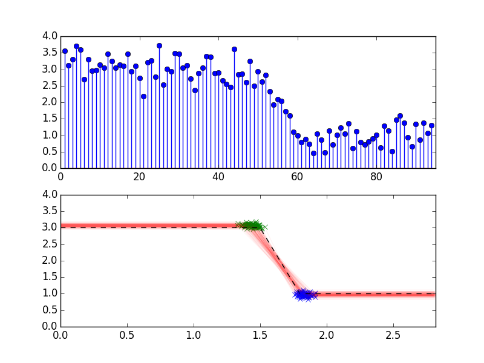

## TODO now
- [x] fix bug in u proposal (T_cycle scaling)
- [x] mh sampling
- [x] plotting in synth_mh may be off by one cycle, improve ploting!
- [ ] gaussian shot noise
- [ ] animation

## embellishment menu
- [ ] infer number of slopey bits (RJ MCMC)
- [ ] positive probability of instantaneous jumps (just make slopey duration density have a delta at zero)
- [ ] hmc / nuts sampling (sampyl could work, only necessary with more dimensions)
- [ ] reuse of energy levels (just sample energy levels ahead of time, add sequential structure)
- [ ] think about 'energy ladders' in the prior
- [ ] think about multiple fast flat bits: is that an HMM again?

## ideas possibly out of scope / unnecessary
- [ ] geweke tests
- [ ] generate loglike automatically using prob prog!
